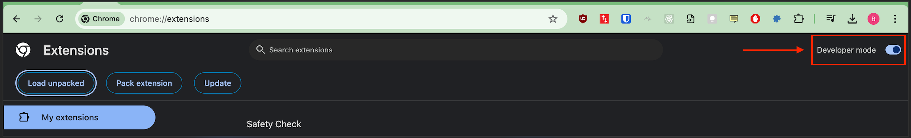
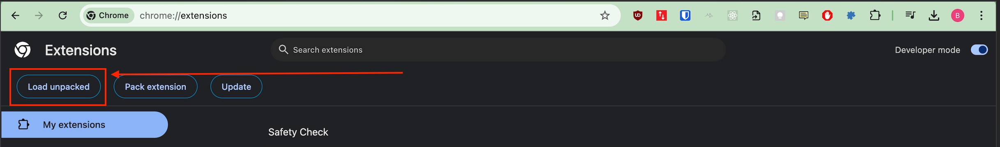
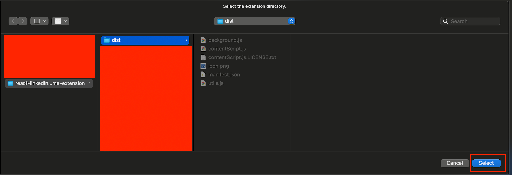
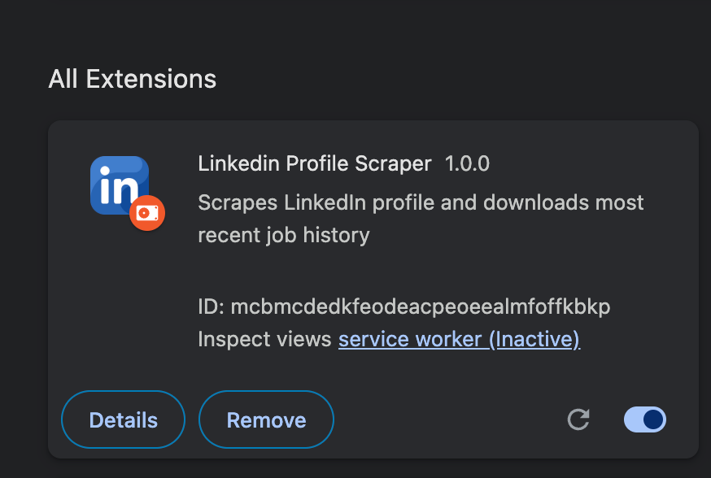
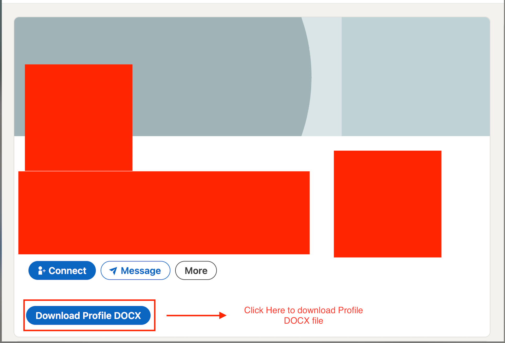

# react-linkedin-resume-extension
Chrome extension that allows for users to scrape Linkedin Profile information and save it as a DOCX file.

Chrome Web Store Link: https://chromewebstore.google.com/detail/linkedin-profile-download/ebjdfpoegdaamleafgbedpimdgjlplja?authuser=0&hl=en 

# Installation
1. Open Chrome browser
2. Browse to the URL `chrome://extensions` in the Chrome browser
3. Enable `Developer Mode` 



4. Download this chrome extension repo: 
```bash
git clone https://github.com/SagaOfAGuy/react-linkedin-resume-extension.git
```

5. Click the `Load Unpacked` button in the browser



6. Browse to the directory that has the chrome extension downloaded, and chose to import the `dist` folder and click on the `select` button



7. Confirm that the extension has been installed:



# Usage
To use the extension, we can follow these steps below: 

1. Browse to a Linkedin Profile page in the chrome browser

2. Click the `Download Profile DOCX` button to download the profile information

